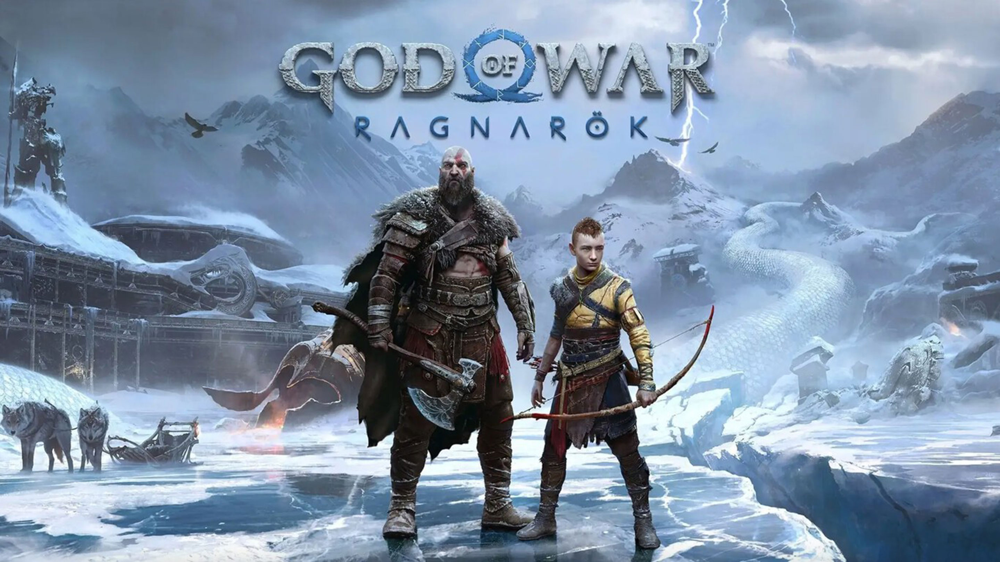
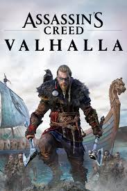

# saimon2092.github.io
pagina web parcial programacion sistemas 1domingos
<!DOCTYPE html>
<html lang="es">
<head>
    <meta charset="UTF-8">
    <meta name="viewport" content="width=device-width, initial-scale=1.0">
    <title>PAGINA WEB PARCIAL</title>
    <link rel="stylesheet" href="style.css">
    

</head>
<body>
    

    

    

        <h1></a></h1>
    
 

    <nav>
        <ul>
            <li></a></li>
            <li></a></li>
            <li></a></li>
            
        </ul>
    </nav>

    <section id="seccion1">
        <html><html><head><title>El camino del triunfo</title></head><body><h1>

Mi Biografia

</h1>

<i><b><u>Simon Andres Botero Villegas</b></i></u>
En <i>1998</i> un <b>31 de Octubre</b> Margarita en la clinica de la ceja antioquia a las <i>3:00 am</i>

Mi padre murio cuando tenia <b>4 años</b>, asi que no lo conoci pero me hubiese gustado, durante toda mi infancia mi madre hizo el papel de mama y papa, me enseño muchas cosas de la vida y todos los valores,ella me dio todo el amor y cariño que necesite para poder ser feliz.

Cuando era niño mis abuelos maternos me cuidaban porque mi mama trabajaba, mis abuelos jugaban conmigo y me ayudaron tambien a mi formacion ya que la mayor parte del tiempo pasaba con ellos, cuando cumpli cinco años entre a preescolar era un niño rebelde y un poco necio pero me gustaba mucho aprender, cuando cumpli <b>11 años</b> entre a secundaria y a la edad de dieciséis años me gradue, prosegui con una tecnica en contabilidad y finanzas,ahora trabajo y estudio con el proposito de cumplir mis sueños
<h3>Sueños y propósitos</h3>

            

            <video src="img/insertar.mp4"controls width="20%" alt="video"></video>

            
    </section>

    <section id="seccion2">
        <title>juegos Dante</title>
    
</head>
<body>
    <header>
        <h1>Videojuegos y Consolas</h1>
    </header>
    <nav>
        
        <a href="https://dixgamer.com/?utm_source=google&utm_medium=ads&utm_campaign=DSA&gad=1/pagina.html#titulo">Catálogo</a>
        <a href="https://vandal.elespanol.com/noticias/videojuegos/pagina.html#titulo">Noticias</a>
        
    </nav>
    

        

            
<h2>God of war-Ragnarok-PS4</h2>
            
            
God of War: Ragnarok es un videojuego de acción y aventuras que continúa la historia de Kratos y su hijo Atreus mientras enfrentan a dioses nórdicos y se adentran en el conflicto apocalíptico del Ragnarok. El juego combina mitología nórdica, combates emocionantes y una narrativa impactante.
<a href="https://www.playstation.com/es-co/games/god-of-war-ragnarok/#buy-now/pagina.html#titulo"><button>COMPRAR</button></a>

        

        

            
<h2>ASSASIN'S CREED VALHALLA-PS4</h2>

        
            
Assassin's Creed Valhalla" es un videojuego de acción y aventuras que te permite tomar el papel de Eivor, un vikingo, mientras exploras la Inglaterra medieval, participas en batallas y te involucras en la lucha entre los Asesinos y los Templarios en una trama épica de conspiración y poder.
<a href="https://store.playstation.com/es-co/product/UP0001-PPSA01491_00-EDITIONDELUXE000?gclid=CjwKCAjwr_CnBhA0EiwAci5sipJdsecAsEb-v5rpeRsNbQAYdUUjfv2-bcTlejFwUMR0uemUUtSlExoCbaEQAvD_BwE&gclsrc=aw.ds&cartAction=add&skuId=UP0001-PPSA01491_00-EDITIONDELUXE000-U002&upSellService=NONE/pagina.html#titulo">
<button>COMPRAR</button>
</a>
        

        

            
<h2>GENSHIN IMPACT-PS4</h2></cemter>
Genshin Impact" es un juego de acción y rol de mundo abierto con un estilo artístico impresionante donde los jugadores exploran un vasto mundo, luchan contra enemigos y reúnen personajes con habilidades únicas mientras desentrañan una trama misteriosa.

<a href="https://store.playstation.com/es-co/concept/10000896">
<button>DESCARGA GRATIS</button>
</a>
        

    

  
        </ul>
    </section>

    <section id="seccion3">
        
<h2>Contactanos</h2>

        

Contactanos en nuestras redes sociales WhatsApp,facebook,instagram para ayudarte con tus dudas

        

            
            
            
        

    </section>
    
</body>
</html>
